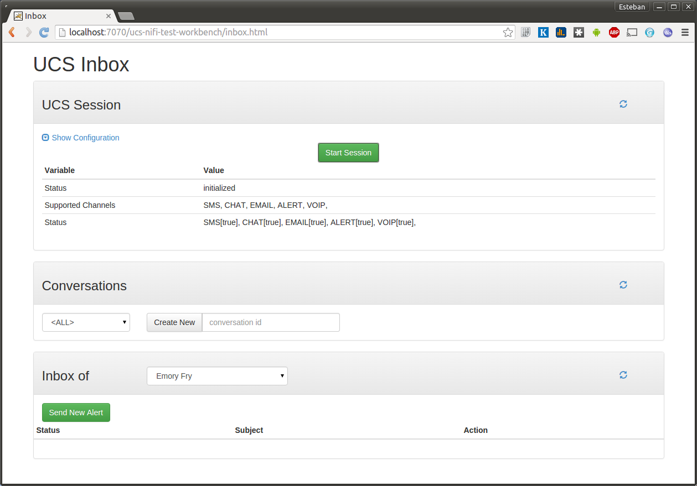

# UCS-Nifi client application
The goal of this project is to serve as an example on how clients are configured in UCS-Nifi. 

This application creates and registers a client to a running instance of UCS-Nifi and listens to messages and/or alerts to arrive. This client has not yet the ability to send messages/alert though (even if, from the code point of view, the only limitation is the UI).

## How to build this project

Before building this project, make sure you have built both [UCS-API](https://bitbucket.org/cogmedsys/ucs-api) and [UCS-Implementation](https://bitbucket.org/cogmedsys/ucs-implementation) (which is the root of this project) projects. 

After **UCS-Implementation** is built, navigate with the command line to this directory and run (this in actually not required because this module was already built as part of **UCS-Implementation**, but let's execute it again just in case we have modified something):

`mvn clean install`

After a clean install, we need to build an executable jar that we can then execute (if you are running this project from your favorite IDE, then this step is not required):

`mvn package assembly:single`

This will generate a file named `ucs-nifi-client-example-0.5-SNAPSHOT-jar-with-dependencies.jar` under the `target` directory. 
## Executing this project
If we have followed the steps in the previous section, we will already have an executable **jar** ready to be started. But before we can actually launch the application, we will need 2 additional steps:

  1. We need a running instance of **UCS-Nifi**
  2. We need to tweak a configuration file in this project that will allow it to communicate with the running **UCS-Nifi** instance. 

### Running UCS-Nifi
The easiest way to have a running instance of **UCS-Nifi** is to use docker. Following the steps describer [here](https://bitbucket.org/cogmedsys/ucs-docker) we should get a **UCS-Nifi** instance up and running wihtout any trouble.

Once the **UCS-Nifi** instance is running, we can access to the Inbox page using the following URL: http://localhost:7070/ucs-nifi-test-workbench/inbox.html

The last step before we can execute our command-line client project is to connect the Inbox with **UCS-Nifi** (after all, the Inbox UI is just another client just like our command-lina app is). In order to connect the Inbox to **UCS-Nifi** we need to click on the green "Start Session" button inside the *UCS Session* section.

If everything went fine, we should now see Statuses and Supported Channels information in the UI, just like the image above is showing.

### ucs-nifi-client-example configuration
**ucs-nifi-client-example** application uses a configuration file to hold its different configuration options. An example of this file can be found [here](src/test/resources/sample-config.json).

    {
    "nifiHost":                 "localhost",
    "nifiClientCommandPort":    8889,
    "nifiAlertingCommandPort":  8890,
    
    "clientHost":               "172.18.0.1"
    }
    
The format of the configuration file, as we can see, is JSON. 
The first 3 configuration elements refer to where **UCS-Nifi** is running. Because **UCS-Nifi** docker image exposes its ports in the host computer, we can access it through **localhost**. **8889** and **8890** are the default ports where **UCS-Nifi** is waiting for new commands to arrive.

Because all the communication between a client and **UCS-Nifi** happens using **HTTP**, 
the client code will automatically start an internal HTTP server so that **UCS-Nifi** can 
communicate back with the client. This mechanism is used, among other things, to 
start asynchronous communications between **UCS-Nifi** and the client. 
The important thing to notice is that the value for **clientHost** must be a host that **UCS-Nifi** can access. 
If **UCS-Nifi** is running inside a docker container, **localhost** is not a valid option here. 

In order to run our client application, we will need to make a copy of [here](src/test/resources/sample-config.json). and tweak whatever configuration option is required (unless conflicts with the client ports exist, the only configuration that has to be modified is the **clientHost**).

### Executing the command-line client
Now that we have everything in place, we can start our simple command-line client. From the command-line, navigate to the directory where this project is (this directoy!) and execute the following command:

`java -jar target/ucs-nifi-client-example-0.5-SNAPSHOT-jar-with-dependencies.jar -cf src/test/resources/sample-config.json`

Please note that the **-cf** argument specifies which configuration file we want to use. In this particular case, we are using the same configuration file that comes in the test resources of this project. There is another argument, **-cs**, that we can use to provide the configuration options as a JSON String instead of as a file.

If everything goes fine, we should get the following output:

Now we are ready to start creating new messages and alerts in the Inbox application.

### Creating Alerts using the Inbox
Back in our Inbox application, we can create new alerts to see how they are received by our command-line client application. 

Before an Alert can be created, we need to create a Conversation first. This is done by using the *Conversations* section in the UI.

Then, using the green "Send New Alert" button we can send an alert to one or more recipients.

When the alert is sent, we our command-line client application will be notified and a message will be print in the console:

Using the Inbox UI, an existing alert can then be updated (its status) or canceled. These operations will also be notified and printed by our simple command-line client. 

